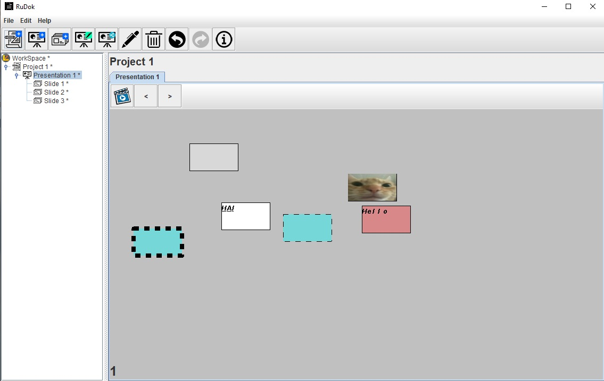
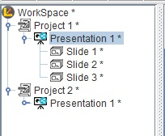

# RuDok

This was a complex MVC architecture project which took us one semester to make. 
The project has a very detailed specification in the "RukovalacDokumentimaSpecifikacija" folder. 
The specification was created using PowerDesigner. 

This is what the application looks like with a created project.

A color picker screen for changing the color of the slots.

Picture picking for the slot. 
There textual and image slots.

This is a slideshow mode where we can switch between slides, and preview the images and text.

There is a interesting feature which allows us to share presentations between projects. 
Each change in any one of the projects that are sharing the same presentation will be reflected in the 
other one because they're using the same memory reference.

